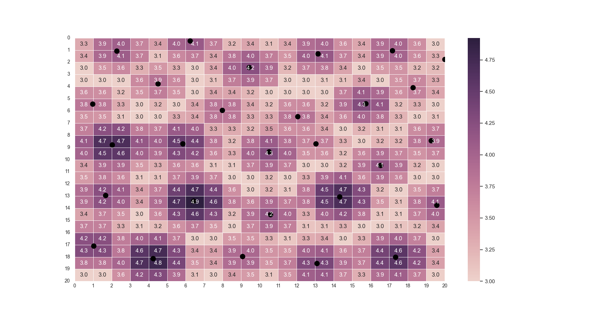

# Communication Network Optimization using Evolutionary Algorithm
The problem is to optimize a communication network for a city with multiple towers and user satisfaction levels using an evolutionary algorithm. The goal is to adjust the power of each tower and their locations in order to minimize the total cost while ensuring that all users have a satisfactory level of service. The problem takes into account the population size of each block in the city and the distance between each block and the towers.
The algorithm tries to find the optimal solution by adjusting the power of each tower and their locations through a genetic algorithm approach. The project provides visualizations to help understand the performance and effectiveness of the algorithm.



## Usage
To run the program and get the answer, execute the `main.py` file. The program reads the `problem_config.txt` file to get the required parameters for the problem, such as user satisfaction levels and tower costs. The `blocks_population.txt` file shows the city map and the population size in each block.

The program outputs the resulting towers and their allocated power, along with other relevant statistics such as the total cost of the towers and the total satisfaction level of the population.

To generate diagrams of the problem and the resulting towers, execute the `visualize.py` file.

### Modifying the problem parameters
To modify the user satisfaction levels or the cost of towers, change the corresponding values in the `problem_config.txt` file.

## Installation
To use this program, you will need to have Python 3 installed on your computer. You will also need to install the following dependencies:

- numpy
- matplotlib
- seaborn
- pandas

You can install these dependencies using pip:
```
pip install numpy matplotlib seaborn pandas
```

## Contributing
Contributions to this project are welcome. If you find a bug or want to suggest an improvement, please open an issue or submit a pull request.
